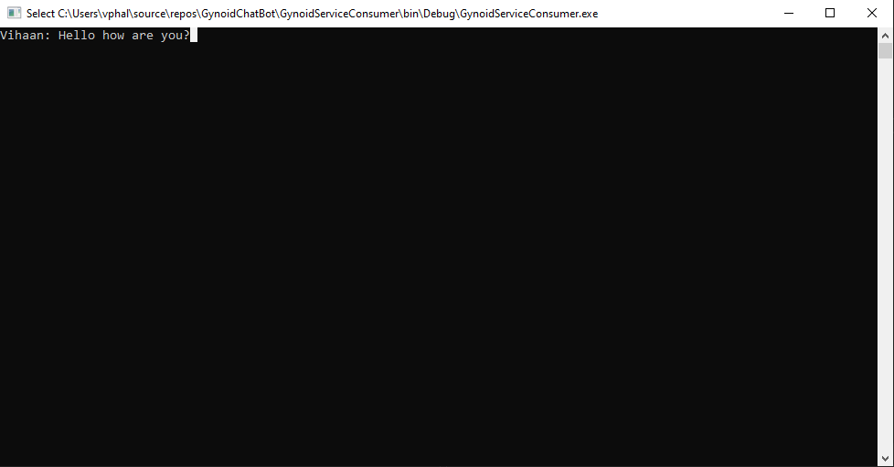
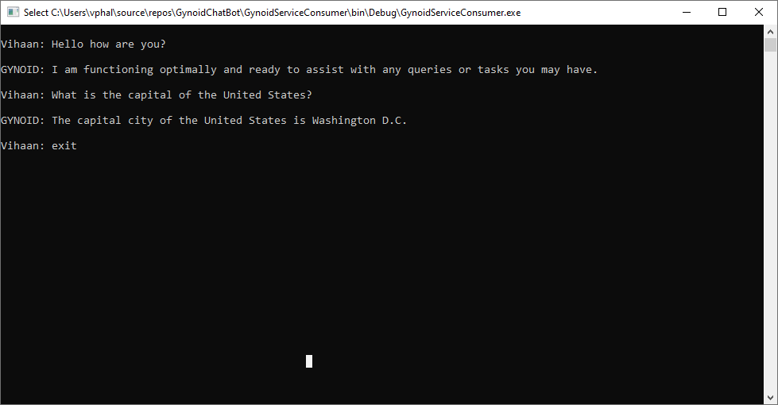
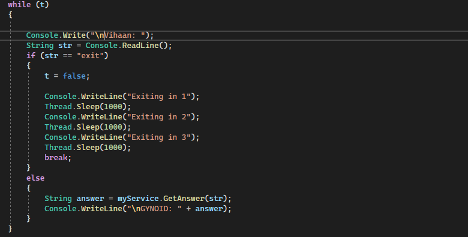

# Gynoid Chatbot App

## Overview

Welcome to the Gynoid Chatbot application, a console-based chat interface that utilizes OpenAI's powerful GPT models to engage users in conversation. This application is built on a .NET framework using a WCF service to interface with OpenAI's API, ensuring dynamic and intelligent responses.

## Features

- Console-based chat interface for easy interaction.
- Integration with OpenAI's API for smart conversational capabilities.
- WCF service application for robust and secure API interactions.
- Simple and clear console application to handle user input and display responses.

## How It Works

The application consists of a WCF service application that communicates with OpenAI's API to fetch responses based on user input. A console application acts as the client, consuming the WCF service and allowing the user to interact with the chatbot. Here's a brief workflow:

1. The console application prompts the user for input.
2. User input is sent to the WCF service, which calls the OpenAI API.
3. The OpenAI API returns a response to the WCF service.
4. The WCF service sends the response back to the console application.
5. The console application displays the response to the user.

## Installation

To get started with the Gynoid Chatbot app:

1. Clone this repository to your local machine.
2. Open the solution file in Visual Studio.
3. Compile and run the WCF service application.
4. Execute the console application to start chatting with Gynoid.

## Usage

- Launch the console application.
- Enter your questions or prompts at the input.
- View Gynoid's responses in the console.
- Type "exit" to terminate the session.

## Screenshots

Here are some screenshots illustrating the Gynoid Chatbot in action:

### User Asking a Question

### Chatbot Interaction

### Exiting Chatbot

### Code Snippet of how it Exits.

## Author

**Vihaan Deepak Phal**

- **LinkedIn**: [vihaanphal](https://www.linkedin.com/in/vihaanphal/)
- **Contact**: +1 (623) 800-3505

## Contribution

Feel free to contribute to the Gynoid Chatbot app by submitting pull requests or opening issues for any bugs or enhancements. Your contributions are welcome! 🌟

## Acknowledgments

- OpenAI for providing the GPT API.
- .NET community for support and resources.
- All contributors who help make this project better!

Give this project a ⭐ if you found it interesting!

 
